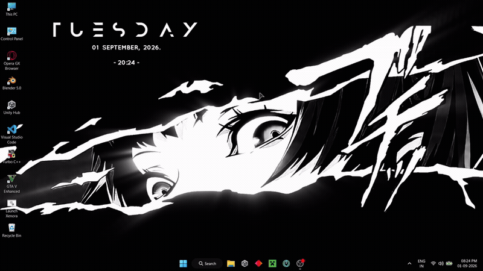
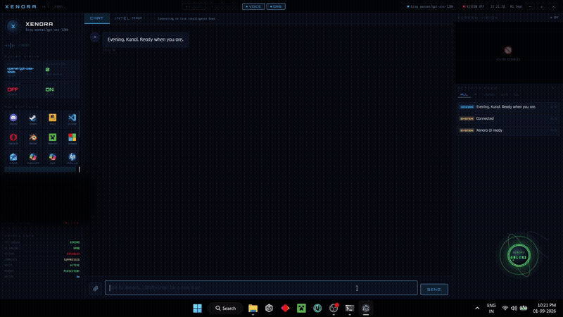
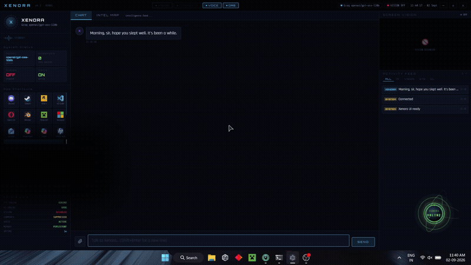

<div align="center">

# ⚡ Xenora
### eXecution Engine for Navigating Operations & Responsive Assistance

[](https://www.python.org/)
[](https://www.electronjs.org/)
[](https://flask.palletsprojects.com/)
[](https://socket.io/)
[](https://groq.com/)
[](https://deepmind.google/technologies/gemini/)
[](https://github.com/thewh1teagle/kokoro-onnx)
[](https://alphacephei.com/vosk/)

<br>

**A stateful, multimodal local desktop AI operating system featuring an interactive multi-window Electron HUD, ambient background vision, zero-console offline wake-word activation, hybrid cloud/edge reasoning, and parallel desktop orchestration.**

</div>

---

## 📌 Overview

**Xenora is a high-throughput, context-aware personal desktop intelligence system designed to eliminate operational friction from everyday computing.** 

Developed across eight months of iterative systems engineering, Xenora unifies natural-language intent parsing with low-level Windows APIs, persistent background screen perception, on-device neural voice synthesis, and multi-process execution pipelines. 

Unlike conventional conversational wrappers, Xenora maintains active spatial awareness of desktop windows, tracks continuous state transitions, evaluates compound conditional workflows, and interfaces via a multi-window Electron HUD.

---

## ✨ System Capabilities

### 🖥️ 1. Multi-Window Interface & HUD
* **Ambient Floating Orb:** Native-draggable widget featuring real-time visual telemetry for system states.
* **Radial Geometric Pie Menu:** Custom trigonometric overlay with mathematical hit detection.
* **Geospatial Terminal:** Real-time world map layer (MapLibre/Leaflet) tracking geopolitical hotspots.

### 👂 2. Standalone Offline Wake-Word
* **Zero-Console Daemon:** Runs silently via `pythonw.exe`, continuously listening using on-device Kaldi/Vosk with zero cloud egress.
* **Constrained Grammar Decoding:** Employs narrow phonetic lookup sets to spot atypical vocal triggers accurately.

### 👁️ 3. Ambient Background Vision
* **Zero-Impact Window Perception:** Captures background surfaces using native Win32 `PrintWindow` APIs without shifting user focus.
* **Multi-Target Token Optimization:** Batches monitored targets within a single dynamically cropped region for structured JSON verdicts.

### 🧠 4. Unified Intent Routing
* **Single-Pass Disambiguation:** Resolves complex, multi-action directives with full conversational and visual context preservation.
* **Compound Execution:** Decomposes conditional requests into sequential primitive steps with deterministic timeouts.

### ⚡ 5. Parallel Desktop Orchestration
* **Multi-App Deployment:** Launches multi-application workspaces in parallel in under 5 seconds.
* **Self-Learning App Locator:** Traverses Start Menu structures and local application trees to locate unknown binaries dynamically.

### 🎙️ 6. Asynchronous Audio Synthesis
* **Non-Blocking Neural TTS:** On-device neural speech generation via Kokoro ONNX.
* **Dedicated Worker Queue:** Audio processing is entirely decoupled from the main thread to prevent UI freezing or execution latency.

---

## 🎬 Core Features & Live Demonstrations

### 1. Zero-Console Background Daemon & Offline Wake-Word
Xenora operates as a persistent, low-overhead background service managed via `pythonw.exe`. The system remains completely dormant without polling cloud resources until armed.

<div align="center">
  
  <br/>
  <i>Real-time execution: Global hotkey hook arming the Vosk speech recognizer followed by offline wake-word activation.</i>
</div>
<br>

> **🛠️ Under the Hood:**
> * **Low-Level Hotkey Hook (`Ctrl + Shift + X`):** A lightweight background listener intercepts the system-level hotkey, activating the audio stream and triggering a hardware confirmation tone via `winsound`.
> * **On-Device Keyword Spotting:** Speech input routes directly to a local, offline Vosk Kaldi recognizer running constrained phonetic grammar rules.
> * **Suppressed Process Spawning:** Upon detecting the `"Xenora"` trigger, the listener unhooks the global keybind and spawns the Electron interface using native `SW_HIDE` / `CREATE_NO_WINDOW` flags.

---

### 2. Multi-Action Intent Resolution & Parallel Execution
Unlike standard single-turn assistants, Xenora resolves complex compound directives containing multiple disjointed intents within a single prompt.

<div align="center">
  
  <br/>
  <i>Compound directive execution: Launching Opera GX, navigating to the official YouTube track, and asynchronously extracting the 8D audio remix to local storage in parallel.</i>
</div>
<br>

> **🛠️ Under the Hood:**
> * **Single-Pass Disambiguation:** The unified intent router breaks down complex multi-clause sentences, ensuring specific modifiers apply strictly to their designated targets.
> * **Parallel Process Spawning:** Application paths and URLs execute in isolated asynchronous threads, deploying desktop software and opening targeted media tabs simultaneously.
> * **Background Media Pipeline:** The downloader runs an asynchronous `yt-dlp` audio extraction routine in the background, writing the MP3 to disk while telemetry streams to the HUD.

---

### 3. Geospatial Intelligence & Live Global Trend Aggregation
Xenora integrates an automated intelligence ingestion engine that parses real-time world events, financial telemetry, and trending topics into an interactive geospatial command layer.

<div align="center">
  
  <br/>
  <i>Dynamic geospatial mapping: Automated multi-source RSS intelligence aggregation, market telemetry, and interactive threat/trend hotspots.</i>
</div>
<br>

> **🛠️ Under the Hood:**
> * **Asynchronous Feed Ingestion:** A persistent background thread aggregates real-time data streams across RSS networks and financial market indices without impacting main runtime execution.
> * **Geospatial Entity Resolution:** Ingested articles and updates are geocoded to specific coordinates and dynamically rendered as pulse vectors across a custom vector map engine.
> * **Interactive Telemetry Drilldown:** Seamless switching between conversational mode and the intelligence canvas allows click-to-expand analysis on live intelligence cards.

---

## 🏛️ System Architecture

```text
                           ┌────────────────────────────┐
                           │   Vosk Background Daemon   │
                           │   (Offline Wake-Word)      │
                           └─────────────┬──────────────┘
                                         │ Hotkey / Voice Trigger
                                         ▼
                           ┌────────────────────────────┐
                           │   Multi-Window Frontend    │
                           │   (Orb / Pie / Intel Map)  │
                           └─────────────┬──────────────┘
                                         │ WebSockets / IPC
                                         ▼
                           ┌────────────────────────────┐
                           │   Unified Intent Router    │
                           │   & Compound Planner       │
                           └─────────────┬──────────────┘
                                         │
         ┌───────────────────────────────┼───────────────────────────────┐
         │                               │                               │
         ▼                               ▼                               ▼
┌──────────────────┐           ┌──────────────────┐            ┌───────────────────┐
│   Hybrid Brain   │           │ Desktop Vision   │            │ Hardware & OS     │
├──────────────────┤           ├──────────────────┤            ├───────────────────┤
│ Primary: Groq    │           │ PrintWindow GDI  │            │ Win32 / ctypes    │
│ Fallback: Ollama │           │ Gemini Vision    │            │ Process Spawning  │
│ Semantic Memory  │           │ Pixel-Diff Gate  │            │ Sockets / Flask   │
└────────┬─────────┘           └─────────┬────────┘            └─────────┬─────────┘
         │                               │                               │
         └───────────────────────────────┼───────────────────────────────┘
                                         │
                                         ▼
                           ┌────────────────────────────┐
                           │  Kokoro ONNX Worker Queue  │
                           │  & Desktop Notification    │
                           └────────────────────────────┘
```

---

## 🛠️ Key Engineering Challenges & Solutions

### 1. Multi-Target Batching for Token Optimization
**The Challenge:** Polling independent background tasks (such as friend presence across games or download progress bars) scales token consumption linearly with each new target.

**The Solution:** Engineered a group-coordinator thread that crops localized dynamic regions (such as chat panes or status docks). It prompts the vision model to return structured JSON evaluating all monitored targets in a single request, bounding API usage to scale with the number of *windows* rather than the number of *targets*.

### 2. Eliminating Voice-Induced Execution Latency
**The Challenge:** Inline neural speech synthesis and character-by-character text streaming blocked the command execution thread, making the assistant unresponsive during long verbal replies.

**The Solution:** Decoupled synthesis, playback, and character streaming into an asynchronous, queue-driven worker thread. Commands complete instantly while speech streams sequentially in the background.

### 3. Fault-Tolerant Hybrid Routing & Hardware Awareness
**The Challenge:** Standard software ACPI suspension commands (`SetSuspendState`) frequently produce silent failures on modern laptop platforms (Modern Standby/S0 states), while intermittent network drops interrupt cloud LLM threads.

**The Solution:** Built defensive hardware-interception layers to guide power states reliably. Paired this with a background connection monitor that automatically switches runtime context to local Ollama models whenever latency spikes or internet access drops.

---

## 💻 Technology Stack

* **Frontend & UI:** Electron, HTML5/CSS3, MapLibre GL, Leaflet, Chart.js, Socket.IO Client
* **Backend Core:** Python 3.12, Flask, Flask-SocketIO, Multithreading (`threading`, `queue`)
* **LLM & Reasoning:** Groq API, Google Gemini Vision API, Ollama (DeepSeek-R1)
* **Voice & Speech:** Kokoro ONNX, Vosk Speech Recognition, SoundDevice, SoundFile
* **OS & Vision Capture:** Windows Win32 API (`pywin32`, `win32gui`, `ctypes`), PyAutoGUI, PIL
* **Web & Automation:** Selenium WebDriver, yt-dlp, Requests

---

## 🔒 Repository Status

This repository serves as a **technical architecture showcase and case study** for the Xenora desktop engine. 

The core execution source code, proprietary prompt schemas, and personal integration scripts remain private to protect system integrity and personal workspace configurations.

---

<div align="center">

**Developed with precision by Kunal**  
*Showcasing local-first desktop autonomy and multimodal systems engineering.*

</div>
